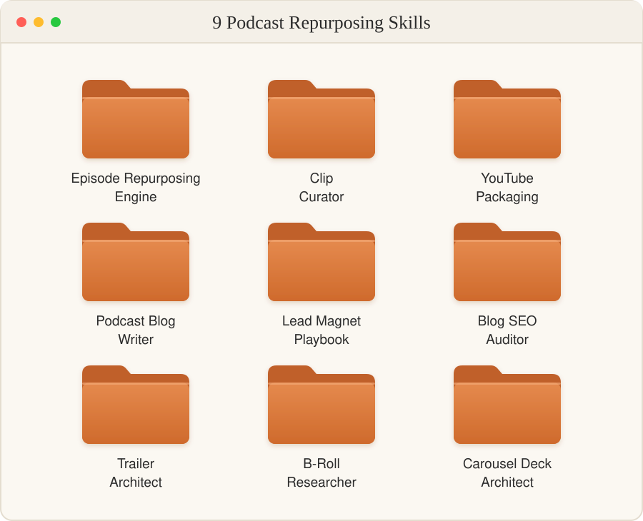
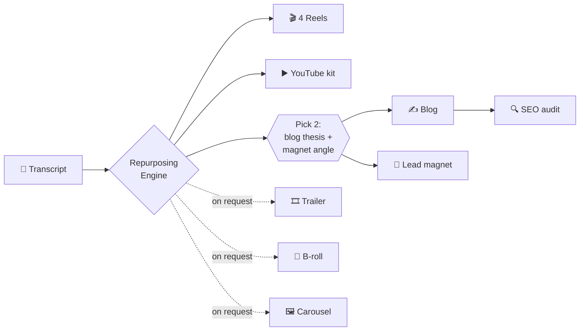

<div align="center">

# Podcast Repurposing Engine

### One transcript in. A month of content out.

**Nine Claude skills that turn a single podcast or webinar recording into reels, a YouTube launch kit, a ranking blog, a lead magnet, a trailer, B-roll research and a carousel.**

**Battle-tested across multiple podcasts and webinars with 500K+ views collectively.**


<br/>



[What you get](#what-you-get) · [How it works](#how-it-works) · [The nine skills](#the-nine-skills) · [Install](#install-in-2-minutes) · [FAQ](#faq)

</div>

---

## You recorded a great episode. Then it died.

Every episode has four reels, a blog post that could rank and a lead magnet someone would trade their email for. Most teams ship one YouTube upload and a LinkedIn post that says "new episode out now."

The problem is not ideas. It is the ten hours of producer work between the recording and the assets: finding the clips, writing the hooks, briefing the editor, packaging the video, drafting the blog, building the freebie.

**This engine does that work in one sitting.** Drop in a transcript, make two decisions, and walk away with editor-ready, publish-ready assets.

## What you get

From **one** transcript:

| Asset | What ships | Built by |
|---|---|---|
| 🎬 **4 Instagram reels** | Full editor build sheets, timed on-screen text, CTA cards, captions, and a trial-reel release plan | `clip-curator` |
| ▶️ **YouTube launch kit** | Hero moment, 3 title + thumbnail combos, description, chapters, tags, testing plan | `youtube-packaging` |
| ✍️ **SEO blog article** | Thesis, keyword map, full article, slug, 5 meta descriptions | `podcast-blog-writer` |
| 🧲 **Lead magnet playbook** | Step-by-step playbook, checklist, AI prompt templates, blended CTA | `lead-magnet-playbook` |
| 🔍 **SEO audit** | Scorecard, prioritized fixes, exact replacement lines | `blog-seo-auditor` |
| 🎞️ **Cold-open trailer** | 90 to 120 second stitch script with a two-peak retention arc | `trailer-architect` |
| 🎥 **B-roll research** | Verified, sourced footage for every segment, with confidence ratings | `broll-researcher` |
| 🖼️ **Carousel deck** | Slide copy, a Gemini image prompt per slide, overlay spec, captions | `carousel-deck-architect` |

And one skill to run them all: **`podcast-repurposing-engine`**.

## How it works



**Only two decisions, both batched into one reply.** The engine produces everything that needs no input first, asks you to pick a blog thesis and a lead magnet angle together, then builds the long-form pieces and audits its own blog. Two choices total, not eight rounds of back-and-forth.

## Why this works when "summarize my podcast" prompts do not

These skills are opinionated systems, tuned on real episodes and real distribution data. Generic prompts are not.

- **Reels built on the Triple Hook Framework.** Every reel opens with Context, then a Lean, then a Snapback that reverses the viewer's expectation, all inside the first twelve seconds. A reel without a real reversal does not ship.
- **Rules learned from live Instagram trials.** One trial reel per episode, four distinct moments, and never a recut of a cut that already ran, because the platform flags near-duplicates.
- **Editor-proof build sheets.** Every beat has a source timestamp, a verbatim line and a timing. Every text card has an in time, an out time, a screen position and exact copy. Your editor never has to message you.
- **Verbatim or nothing.** Quotes are word-for-word, so they can be cut straight from the audio. Moving a line never makes a guest say something they did not mean.
- **Zero invented numbers.** If the guest did not say it, it does not appear in a hook, a title, a thumbnail or a blog.
- **SEO that can actually rank.** The blog writer targets low-difficulty, high-intent keywords your domain can win, not head terms it cannot.
- **Retention-engineered trailers.** A two-peak arc, 30 to 40 percent host airtime, and a final line that opens a loop only the full episode closes.
- **B-roll with real links.** Every source URL is one the skill actually found. Anything it cannot verify gets flagged for your editor instead of made up.
- **Carousels that render.** Image prompts put all slide text in a quoted, positioned list, which is what stops Gemini from garbling it.

## The nine skills

<details>
<summary><b>🧠 podcast-repurposing-engine</b>: the orchestrator</summary>

Reads the transcript once, prints a run manifest, then runs every sub-skill in the right order, one deliverable per turn so quality never collapses. Handles partial runs ("just clips and YouTube") and offers the trailer, B-roll and carousel as add-ons.
</details>

<details>
<summary><b>🎬 clip-curator</b>: four fully built Instagram reels</summary>

Triage shortlist of 12 to 20 moments, the four selected reels, a complete editor build sheet for each (script beats, lifted lines, on-screen text schedule, CTA card specs, cover frame, caption, alt text, export spec), and a release plan naming the single trial pick with graduation benchmarks.
</details>

<details>
<summary><b>▶️ youtube-packaging</b>: the YouTube launch kit</summary>

Hero moment extraction, three title and thumbnail sets that each attack a different angle (the claim, the outcome, the tension), a description built for the fold, 8 to 14 chapters, tags, hashtags, and a testing note on when to swap titles.
</details>

<details>
<summary><b>✍️ podcast-blog-writer</b>: a long-form article that ranks</summary>

Proposes 2 to 3 editorial theses (arguments, not topics), each with a keyword map. You pick one. Then it writes the full article with keyword placement, skimmable H2s, verbatim guest quotes, a podcast callout, internal links, a slug and five meta descriptions.
</details>

<details>
<summary><b>🧲 lead-magnet-playbook</b>: a gated asset worth an email</summary>

Extracts every framework and tactic from the transcript, finds the single growth narrative that connects them, and proposes three angles. You pick one. Then it builds an execution-ready playbook with a checklist and AI prompt templates, built only from what the session actually taught.
</details>

<details>
<summary><b>🔍 blog-seo-auditor</b>: QA before you publish</summary>

Five-phase audit covering headline, keyword placement, search intent, structure, linking and SERP features. Outputs a scorecard, prioritized recommendations and exact replacement text. Never "tighten this section."
</details>

<details>
<summary><b>🎞️ trailer-architect</b>: a cold open that sells the episode</summary>

8 to 12 verbatim clips stitched into a 90 to 120 second trailer for YouTube and Spotify: hook, setup, escalation, second peak, tease. Runs a 10-point quality check before it returns anything.
</details>

<details>
<summary><b>🎥 broll-researcher</b>: sourced footage for every segment</summary>

Researches the guest once, then segments the transcript and matches each idea to real, linkable footage, picking the strongest 7-second window. Every recommendation carries a confidence rating your editor can triage on.
</details>

<details>
<summary><b>🖼️ carousel-deck-architect</b>: an Instagram or LinkedIn carousel in one shot</summary>

Slide copy, a Gemini image prompt per slide, and the overlay design spec, with no clarifying questions. Ships with a 13-archetype image library, a design system and a production checklist.
</details>

## Install in 2 minutes

### Option 1: Claude Code plugin (one command)

```
/plugin marketplace add rohitabrahamgeorge/podcast-repurposing-engine
/plugin install podcast-repurposing-engine@podcast-repurposing-engine
```

The first time a skill runs, it asks for your show name, host and brand, then uses them everywhere.

### Option 2: Set your show profile once (recommended)

```bash
git clone https://github.com/rohitabrahamgeorge/podcast-repurposing-engine.git
cd podcast-repurposing-engine
./setup.sh
```

`setup.sh` asks for your show name, host, brand, audience and niche, fills them into every skill, and installs all nine into `~/.claude/skills`.

### Option 3: Claude.ai

```bash
./setup.sh --zip
```

Then upload each zip from `dist/` in Claude.ai under **Settings > Capabilities > Skills**.

## Use it

Drop a transcript into Claude and say:

> **"Repurpose this episode."**

Or run a single skill:

> "Build the reels from this transcript." · "YouTube package for this episode." · "Make a trailer." · "Find B-roll for the Jordan Lee episode." · "Turn this into a carousel."

**Tip:** timestamped transcripts give the best results. Reels, trailers and B-roll all cut on exact timecodes, and the skills will never invent one.

## FAQ

**Does this only work for podcasts?**
No. Webinars, panels, live sessions, interviews and keynotes all work. If it has a transcript, it can be repurposed.

**Is it tuned for a specific niche?**
Out of the box it is tuned for B2B, growth and GTM audiences. Change the audience and niche in `setup.sh`, and edit the Recurring Themes block in `trailer-architect` to match your show.

**Which model should I use?**
The most capable Claude model you have access to. The reel build sheets are long and detailed, and they benefit from it.

**Do I need an editor?**
The skills write the brief. A human, or your editing tool of choice, still cuts the video. That is the point: your editor gets a spec, not a vague request.

## Want this running on your show?

I built and tuned these skills on real shows. If you want help setting them up for your podcast or webinar series, customizing them to your voice, or building a skill for a workflow you run every week, [open an issue](https://github.com/rohitabrahamgeorge/podcast-repurposing-engine/issues) or reach out through [my GitHub profile](https://github.com/rohitabrahamgeorge).

<div align="center">

**If this saves you a day of production work, ⭐ star the repo** so other creators can find it.

</div>

## License

MIT. Free to use, fork and adapt, including for client work. See [LICENSE](LICENSE).
